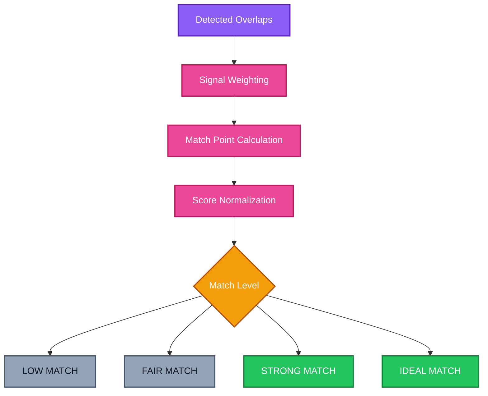
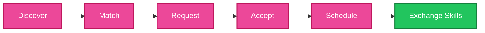
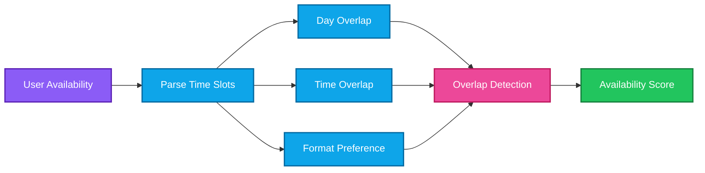
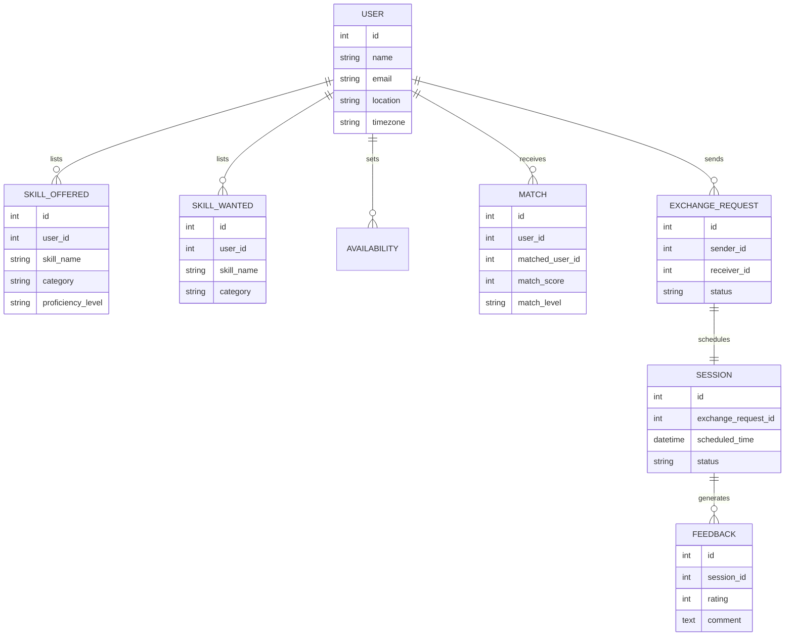
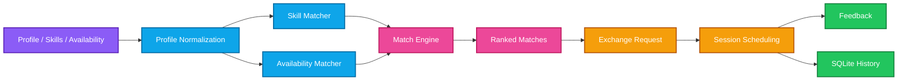
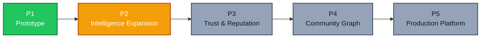
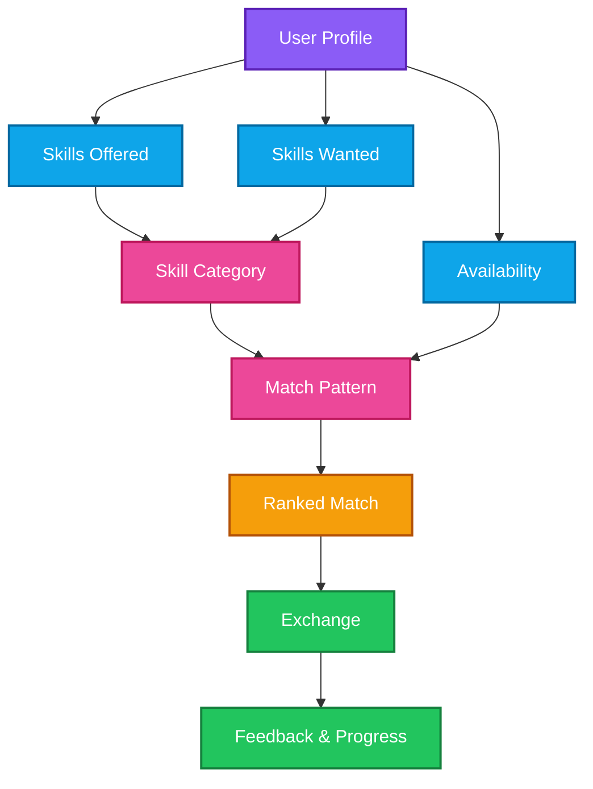

<div align="center">


<h1>SkillSwap</h1>

<h3>Don't Just Learn Alone. Trade Skills.</h3>

<p>A peer-to-peer skill exchange platform where people teach what they know and learn what they don't.</p>

<p>
  
  
  
  
</p>

<p>
  
  
  
  
  
  
</p>

<sub><b>Overview</b>  ·  <b>Architecture</b>  ·  <b>Matching</b>  ·  <b>Exchange Engine</b>  ·  <b>API</b>  ·  <b>Getting Started</b>  ·  <b>Roadmap</b></sub>

</div>

<br/>

<table align="center">
<tr>
<td align="center" width="20%"><b>2</b><br/><sub>Skill Lists per User</sub></td>
<td align="center" width="20%"><b>100</b><br/><sub>Match Score</sub></td>
<td align="center" width="20%"><b>6+</b><br/><sub>Matching Signals</sub></td>
<td align="center" width="20%"><b>Transparent</b><br/><sub>Match Reasoning</sub></td>
<td align="center" width="20%"><b>Community</b><br/><sub>Driven Learning</sub></td>
</tr>
</table>

<br/>

---

## Table of Contents

|                                                          |                                                            |                                                      |
| -------------------------------------------------------- | ---------------------------------------------------------- | ---------------------------------------------------- |
| [01 · About](#about)                                     | [08 · Exchange Anatomy](#exchange-anatomy)                 | [15 · Frontend Experience](#frontend-experience)     |
| [02 · The Problem](#the-problem)                         | [09 · Show Me The Match](#show-me-the-match)                | [16 · Exchange History](#exchange-history) |
| [03 · Product Philosophy](#product-philosophy)           | [10 · Match Report](#match-report)                          | [17 · Project Structure](#project-structure)         |
| [04 · Core Differentiator](#core-differentiator)         | [11 · System Architecture](#system-architecture)           | [18 · Getting Started](#getting-started)             |
| [05 · Exchange Workflow](#exchange-workflow)             | [12 · Tech Stack](#tech-stack)                              | [19 · Demo Flow](#demo-flow)                         |
| [06 · Explainable Matching Engine](#explainable-matching-engine) | [13 · Data Model](#data-model)                       | [20 · Roadmap](#roadmap)                             |
| [07 · Profile Layer](#profile-layer)                     | [14 · API Design](#api-design)                              | [21 · Vision](#vision)                               |

---

## About

**SkillSwap** is a peer-to-peer skill exchange platform designed to help people **teach the skills they know and learn the skills they want**, without money changing hands.

Instead of simply telling users:

> "Here's a random person who also wants to trade skills."

SkillSwap matches and explains:

```text
What skills you offer
        ↓
What skills you want
        ↓
Who overlaps with you
        ↓
Why they're a good match
        ↓
How the match score was calculated
        ↓
What to do next
```

The goal is to transform skill exchange from a simple **listing board** into a **guided, explainable matching experience**.

### Core Principle

> **Listing tells you who's out there. Matching tells you who's right for you.**

SkillSwap combines profiles, skill taxonomies, availability, deterministic match scoring, request/accept flows, and session scheduling into a single exchange pipeline.

---

## The Problem

Learning a new skill usually means:

* Paying for a course
* Searching scattered forums for a mentor
* Never finding someone who wants what you can teach in return
* Losing track of who you agreed to swap with
* No structured way to confirm the exchange actually happened

Consider:

```text
I know Photoshop and want to learn Guitar.

Somewhere out there is a guitarist who wants
to learn Photoshop — but how do I find them?
```

A normal user may not know:

* Who else on the platform wants to learn what they teach
* Whether a potential match is actually available when they are
* How "good" a match really is
* Whether the other person is reliable
* What happens after both sides agree to swap

Most skill-sharing communities focus heavily on listings.

SkillSwap focuses on:

```text
Matching
     +
Scheduling
     +
Accountability
```

### The Traditional Problem

<table>
<tr>
<td align="center" width="33%" valign="top">

**01 · Static Listings**

Directories show who exists but not who actually fits your needs.

</td>

<td align="center" width="33%" valign="top">

**02 · No Reciprocity Check**

Most platforms don't verify that both sides actually benefit from the swap.

</td>

<td align="center" width="33%" valign="top">

**03 · Fragmented Follow-Through**

Finding a match, scheduling a session, and tracking feedback are usually disconnected.

</td>
</tr>
</table>

### From Listing to Matching

```mermaid
flowchart LR

    A["Skill Profile"] --> B["Discovery"]
    B --> C["Match Score"]
    C --> D["SkillSwap Matching"]
    D --> E["Exchange Request"]
    E --> F["Scheduled Session"]
    F --> G["Feedback & Progress"]

    classDef input fill:#8B5CF6,stroke:#5B21B6,color:#fff,stroke-width:2px
    classDef process fill:#0EA5E9,stroke:#0369A1,color:#fff,stroke-width:2px
    classDef output fill:#22C55E,stroke:#15803D,color:#fff,stroke-width:2px

    class A input
    class B,C,D,E,F process
    class G output
```



---

## Product Philosophy

> **A platform should not just say "here are some people." It should show the user why a match makes sense.**

SkillSwap is designed around one principle:

```text
Skill Profiles
     +
Availability
     +
Preferences
     +
Deterministic Matching
     ↓
Explainable Recommendation
```

The matching algorithm is **not a black box**.

Instead:

```text
Skills Offered
      +
Skills Wanted
      +
Availability Overlap
      +
Activity & Reliability
      ↓
Deterministic Match Engine
      ↓
Match Report
```

This makes the system more transparent, predictable, and trustworthy.

### Matching as an Assistant

The system analyzes profiles and identifies overlap.

It surfaces the reasoning behind every suggestion.

Therefore:

> **Matching is a guide, not a gatekeeper.**

---

## Core Differentiator

### Explainable Peer Matching

The core differentiator of SkillSwap is that it does not stop at "here's a list of users."

It connects:

```text
PROFILE
  ↓
SKILL OVERLAP
  ↓
AVAILABILITY
  ↓
MATCH SCORE
  ↓
REQUEST
  ↓
SESSION
  ↓
FEEDBACK
```

For example:

```text
"Teaches Photoshop, wants Guitar"
     ↓
Matched against
"Teaches Guitar, wants Photoshop"
     ↓
+40 Reciprocal Skill Match
     ↓
Both sides benefit directly
```

Another example:

```text
"Available weekday evenings"
     ↓
Overlaps with
"Available weekday evenings"
     ↓
+20 Availability Match
     ↓
Scheduling friction removed
```

The user doesn't have to guess who's worth reaching out to.

**The system shows the reasoning.**

---

## Exchange Workflow

### End-to-End Exchange Lifecycle

```mermaid
flowchart LR

    A["User Registration<br/>Profile Setup"]
    --> B["Add Skills<br/>Teach / Learn"]

    B --> C["Set Availability"]
    C --> D["Matching Engine"]

    D --> E["Suggested Matches"]
    E --> F["Send Request"]
    F --> G["Accept / Decline"]
    G --> H["Schedule Session"]
    H --> I["Complete Exchange"]
    I --> J["Feedback"]
    J --> K["Progress Tracking"]

    classDef input fill:#8B5CF6,stroke:#5B21B6,color:#fff,stroke-width:2px
    classDef process fill:#0EA5E9,stroke:#0369A1,color:#fff,stroke-width:2px
    classDef match fill:#EC4899,stroke:#BE185D,color:#fff,stroke-width:2px
    classDef output fill:#22C55E,stroke:#15803D,color:#fff,stroke-width:2px

    class A,B,C input
    class D,E match
    class F,G,H,I process
    class J,K output
```



### Exchange Pipeline

```text
01  Register
        ↓
02  Create Profile
        ↓
03  Add Skills to Teach
        ↓
04  Add Skills to Learn
        ↓
05  Set Availability
        ↓
06  Generate Matches
        ↓
07  Send Exchange Request
        ↓
08  Accept Request
        ↓
09  Schedule Session
        ↓
10  Complete Session
        ↓
11  Give Feedback
        ↓
12  Track Progress
```

---

## Skill Categories

SkillSwap supports skills across a wide range of categories.

<table>
<tr>
<td align="center" width="33%" valign="top">

### Skills to Teach

Users list what they can offer:

* Design (Photoshop, Figma)
* Music (Guitar, Piano)
* Coding (Python, Web Dev)
* Languages
* Cooking
* Writing
* Fitness coaching
* Photography

</td>

<td align="center" width="33%" valign="top">

### Skills to Learn

Users list what they want:

* A new instrument
* A programming language
* A creative craft
* A spoken language
* A fitness discipline
* A design tool
* A life skill

</td>

<td align="center" width="33%" valign="top">

### Availability

Users set when they're free:

* Weekday mornings
* Weekday evenings
* Weekends
* Flexible / async
* Preferred session length
* Online or in-person

</td>
</tr>
</table>

### Matching Pipeline

```text
Profile
    ↓
Skills Offered
    ↓
Skills Wanted
    ↓
Availability
    ↓
Candidate Pool
    ↓
Score Calculation
    ↓
Ranked Matches
```

Users can review a match's overlap before sending a request.

---

## Explainable Matching Engine

One of SkillSwap's most important design decisions is that matching should **not be a random suggestion**.

SkillSwap uses a deterministic matching engine.

### Match Signals

| Signal                     | Match Points |
| --------------------------- | ----------: |
| Reciprocal Skill Match       |         +40 |
| Availability Overlap         |         +20 |
| Shared Interest Category     |         +10 |
| Response Rate / Reliability  |         +10 |
| Proximity / Same Timezone    |         +10 |
| Positive Feedback History    |         +10 |

The score is normalized to:

```text
0 – 30      LOW MATCH

31 – 60     FAIR MATCH

61 – 80     STRONG MATCH

81 – 100    IDEAL MATCH
```

### Example

Instead of:

```text
System says:

"87% match."
```

SkillSwap explains:

```text
87 / 100

+40  Reciprocal Skill Match (Photoshop ⇄ Guitar)
+20  Availability Overlap (Weekday Evenings)
+10  Shared Interest Category (Creative Skills)
+10  Reliability (Fast responder)
+7   Positive Feedback History
```

The user can understand **where the score came from**.

### Matching Engine



---

## Profile Layer

### The Heart of SkillSwap

The Profile Layer connects a user's skills, goals, and availability directly to the match score.

Suppose a user's profile is:

```text
Teaches: Photoshop, Video Editing

Wants to Learn: Guitar

Available: Weekday Evenings
```

SkillSwap breaks the match down.

### Signal 01

```text
"Teaches Photoshop"
```

**Reciprocal Skill Match**

Matched against someone who wants to learn Photoshop.

```text
+40 match points
```

### Signal 02

```text
"Wants to Learn Guitar"
```

**Reciprocal Skill Match**

Matched against someone who teaches Guitar.

```text
+40 match points
```

### Signal 03

```text
"Available Weekday Evenings"
```

**Availability Overlap**

Both users share the same free time window.

```text
+20 match points
```

### Signal 04

```text
"4.8★ average feedback"
```

**Reliability Signal**

Consistent, positive session history.

```text
+10 match points
```

### Match Chain

```mermaid
flowchart LR

    A["User Profile"]
    --> B["Skill or Preference"]

    B --> C["Detected Signal"]

    C --> D["Match Explanation"]

    D --> E["Score Contribution"]

    classDef original fill:#8B5CF6,stroke:#5B21B6,color:#fff,stroke-width:2px
    classDef phrase fill:#EC4899,stroke:#BE185D,color:#fff,stroke-width:2px
    classDef tactic fill:#F59E0B,stroke:#B45309,color:#fff,stroke-width:2px
    classDef evidence fill:#0EA5E9,stroke:#0369A1,color:#fff,stroke-width:2px
    classDef risk fill:#22C55E,stroke:#15803D,color:#fff,stroke-width:2px

    class A original
    class B phrase
    class C tactic
    class D evidence
    class E risk
```



This makes SkillSwap a transparent matcher instead of a black-box recommender.

---

## Exchange Anatomy

SkillSwap includes a visual **Exchange Anatomy** feature.

It shows how a skill swap moves from first contact to completed learning.

### Example

```text
          DISCOVERY
                ↓
         MATCH SUGGESTED
                ↓
          REQUEST SENT
                ↓
        REQUEST ACCEPTED
                ↓
       SESSION SCHEDULED
                ↓
          SKILLS TRADED
                ↓
        FEEDBACK RECORDED
```

### Exchange Sequence



SkillSwap therefore becomes more than a listing tool.

It becomes a **guided exchange system** that carries a match all the way to a completed learning session.

---

## Show Me The Match

Another important SkillSwap feature is:

```text
SHOW ME THE MATCH
```

When activated, SkillSwap highlights exactly which parts of two profiles caused the match.

### Example

```text
You teach: Photoshop, Video Editing
You want:  Guitar

They teach: Guitar, Music Theory
They want:  Photoshop
```

SkillSwap explains:

```text
Photoshop
→ You teach it, they want it

Guitar
→ They teach it, you want it

Weekday Evenings
→ Both available
```

### Direct Explanation Chain

```text
Two Profiles
   ↓
Overlapping Skill or Slot
   ↓
Match Signal
   ↓
Explanation
   ↓
Score Contribution
```

This gives users a direct visual connection between **what's on each profile** and **why the match was suggested**.

---

## Match Report

A complete match can contain:

```text
SKILLSWAP MATCH REPORT

────────────────────────

MATCH SCORE

87 / 100

STRONG MATCH

────────────────────────

MATCHED USER

Riya M.
4.8★ · 12 completed exchanges

────────────────────────

SCORE BREAKDOWN

Reciprocal Skill Match   +40
Availability Overlap     +20
Shared Interest Category +10
Reliability              +10
Feedback History         +7

────────────────────────

OVERLAP

01  Photoshop
    You teach → They want

02  Guitar
    They teach → You want

03  Weekday Evenings
    Shared availability

────────────────────────

EXCHANGE ANATOMY

Discovery
  ↓
Match
  ↓
Request
  ↓
Accept
  ↓
Schedule

────────────────────────

RECOMMENDED ACTION

SEND AN EXCHANGE REQUEST

PROPOSE A WEEKDAY EVENING SLOT

CONFIRM SESSION FORMAT (ONLINE / IN-PERSON)
```

---

## Matching Intelligence

SkillSwap's backend runs the matching logic in Python.

The engine is responsible for comparing profiles and identifying overlap.

It can detect:

* Reciprocal skill matches
* Availability overlap
* Shared interest categories
* Reliability and response rate
* Feedback and rating history
* Skill category adjacency (e.g. Design ↔ Illustration)

### Structured Match Output

```json
{
  "reciprocal_skill_match": true,
  "availability_overlap": true,
  "shared_category": true,
  "reliable_responder": true,
  "positive_feedback": true,
  "match_score": 87
}
```

The backend combines these signals into a single deterministic score.

### Architecture Principle

```text
              USER PROFILES
                    │
                    ▼
          Skill & Availability Parsing
                    │
                    ▼
          Structured Match Signals
                    │
                    ▼
        ┌─────────────────────┐
        │   Deterministic     │
        │   Matching Engine   │
        └─────────────────────┘
                    │
                    ▼
          Explainable Match Report
```

---

## Availability Intelligence

Users set their availability once and reuse it across all matches.

Example:

```text
Weekday Evenings, Online, 60-minute sessions
```

SkillSwap analyzes characteristics such as:

* Day-of-week overlap
* Time-of-day overlap
* Session length preference
* Online vs in-person preference
* Timezone difference
* Recurring vs one-off availability

### Scheduling Principle

SkillSwap does **not auto-book sessions on a user's behalf**.

The prototype surfaces overlapping availability and lets both users confirm a time.

This keeps scheduling under the user's control rather than automated.

### Availability Matching Pipeline



---

## System Architecture

```text
                         SKILLSWAP
                             │
                           USER
                             │
                             ▼
                    ┌─────────────────┐
                    │ React Frontend  │
                    │    Tailwind     │
                    └────────┬────────┘
                             │
                             ▼
                    ┌─────────────────┐
                    │    Streamlit    │
                    │     Backend     │
                    └────────┬────────┘
                             │
              ┌──────────────┼──────────────┐
              │              │              │
              ▼              ▼              ▼
        ┌──────────┐   ┌──────────┐   ┌──────────┐
        │ Profile  │   │ Skill    │   │Availability│
        │ Manager  │   │ Matcher  │   │  Engine  │
        └────┬─────┘   └────┬─────┘   └────┬─────┘
             │              │              │
             └──────────────┼──────────────┘
                            ▼
                    ┌──────────────┐
                    │  Matching    │
                    │   Engine     │
                    └──────┬───────┘
                           │
                           ▼
                    ┌──────────────┐
                    │   Request /  │
                    │Accept Engine │
                    └──────┬───────┘
                           │
                           ▼
                   ┌───────────────┐
                   │  Scheduling   │
                   └───────┬───────┘
                           │
                           ▼
                  Feedback & Progress
                           │
                           ▼
                         SQLite
```

### Architectural Principle

SkillSwap separates:

```text
Profile
  ↓
Matching
  ↓
Request
  ↓
Scheduling
  ↓
Exchange
  ↓
Feedback
```

This keeps the system modular and easy to extend.

---

## Tech Stack

<table>
<tr>
<td valign="top" width="33%">

**Frontend**

<br/> <br/> <br/> <br/> <br/> 

</td>

<td valign="top" width="33%">

**Backend**

<br/> <br/> <br/> 

</td>

<td valign="top" width="33%">

**Data**

<br/> <br/> <br/> 

</td>
</tr>
</table>

### Matching Layer

```text
pandas
datetime
difflib
re
```

---

## Data Model

SkillSwap uses SQLite for the prototype.

### users

Stores every registered user.

```text
id
name
email
bio
location
timezone
created_at
```

### skills_offered

Stores skills a user can teach.

```text
id
user_id
skill_name
category
proficiency_level
```

### skills_wanted

Stores skills a user wants to learn.

```text
id
user_id
skill_name
category
priority
```

### availability

Stores a user's free time slots.

```text
id
user_id
day_of_week
time_slot
session_format
```

### matches

Stores generated match suggestions.

```text
id
user_id
matched_user_id
match_score
match_level
created_at
```

### exchange_requests

Stores sent and accepted requests.

```text
id
sender_id
receiver_id
status
message
created_at
```

### sessions

Stores scheduled skill-sharing sessions.

```text
id
exchange_request_id
scheduled_time
duration_minutes
format
status
```

### feedback

Stores post-session feedback.

```text
id
session_id
rating
comment
skill_learned
created_at
```

### Entity Relationship



---

## API Design

### Create Profile

```http
POST /api/users
```

Registers a new user and creates their profile.

### Add Skill Offered / Wanted

```http
POST /api/skills
```

Adds a skill a user can teach or wants to learn.

### Get Matches

```http
GET /api/matches/{user_id}
```

Returns ranked, explainable match suggestions for a user.

### Send Exchange Request

```http
POST /api/requests
```

Sends a skill exchange request to a matched user.

### Respond to Request

```http
PATCH /api/requests/{id}
```

Accepts or declines a pending request.

### Schedule Session

```http
POST /api/sessions
```

Schedules a skill-sharing session for an accepted request.

### Submit Feedback

```http
POST /api/feedback
```

Records feedback after a completed session.

### Health Check

```http
GET /api/health
```

Checks backend availability.

### Example Response

```json
{
  "user_id": 12,
  "match_score": 87,
  "match_level": "STRONG MATCH",
  "overlap": [],
  "recommendations": []
}
```

---

## Frontend Experience

SkillSwap uses a friendly, community-driven aesthetic.

### Visual Identity

```text
BACKGROUND
White

PRIMARY
Pink / Magenta

TEXT
Dark Charcoal

BORDERS
Soft Gray

SUCCESS
Green

PENDING
Yellow / Orange

IDEAL MATCH
Purple
```

The interface should feel:

* Friendly
* Trustworthy
* Community-driven
* Modern
* Encouraging

### Core Surfaces

| Surface                    | Purpose                                |
| --------------------------- | --------------------------------------- |
| **Profile Setup**           | Add bio, skills offered, skills wanted |
| **Skill Input**              | Add or edit skills to teach            |
| **Learning Goals Input**     | Add or edit skills to learn            |
| **Availability Picker**      | Set free time slots and format         |
| **Match Suggestions**        | Show ranked, explainable matches       |
| **Match Score Card**         | Display explainable score              |
| **Overlap List**             | Show matched skills and slots          |
| **Score Breakdown**          | Show point contributions               |
| **Request Panel**            | Send / accept / decline requests       |
| **Session Scheduler**        | Pick a confirmed time and format       |
| **Feedback Form**            | Rate and review a completed session    |
| **Progress Tracker**         | Show skills learned and taught         |
| **History**                  | Review past exchanges                  |

### Match Processing

The interface can show actual processing stages:

```text
Reading your profile
       ↓
Scanning skill pool
       ↓
Checking availability
       ↓
Scoring overlaps
       ↓
Ranking matches
       ↓
Generating match report
```

---

## Exchange History

Every exchange can be stored and reviewed.

A history view can expose:

| Exchange              | Skill Taught | Skill Learned | Score | Status    |
| ---------------------- | ------------ | -------------- | ----: | --------- |
| With Riya M.            | Photoshop    | Guitar         |    87 | Completed |
| With Aman K.             | Python       | Spanish        |    74 | Completed |
| With Neha S.             | Baking       | Yoga           |    69 | Scheduled |

Each record can preserve:

```text
Matched User
Match Score
Skill Taught
Skill Learned
Session Date
Feedback & Rating
Created At
```

This turns individual swaps into a trackable learning history.

---

## Safe Exchange Principles

SkillSwap is designed with trust in mind.

### 01 · Do Not Auto-Schedule Sessions

The prototype surfaces overlapping availability rather than booking sessions without confirmation from both users.

### 02 · Matching Is Not Randomized

The final match score is generated through a deterministic scoring model.

### 03 · Overlap Must Support the Score

A match should be traceable to specific shared skills or availability.

### 04 · User Remains in Control

SkillSwap suggests matches and time slots; users decide whether to send, accept, or schedule.

### 05 · Feedback Builds Trust

Ratings and comments accumulate into a reliability signal used in future matching.

---

## Project Structure

```text
skillswap/
│
├── frontend/
│   ├── src/
│   │   ├── components/
│   │   │   ├── Navbar.jsx
│   │   │   ├── ProfileForm.jsx
│   │   │   ├── SkillOfferedInput.jsx
│   │   │   ├── SkillWantedInput.jsx
│   │   │   ├── AvailabilityPicker.jsx
│   │   │   ├── MatchCard.jsx
│   │   │   ├── MatchScore.jsx
│   │   │   ├── OverlapList.jsx
│   │   │   ├── ScoreBreakdown.jsx
│   │   │   ├── RequestPanel.jsx
│   │   │   ├── SessionScheduler.jsx
│   │   │   ├── FeedbackForm.jsx
│   │   │   └── ProgressTracker.jsx
│   │   │
│   │   ├── pages/
│   │   │   ├── Home.jsx
│   │   │   ├── Matches.jsx
│   │   │   └── History.jsx
│   │   │
│   │   ├── services/
│   │   │   └── api.js
│   │   │
│   │   ├── App.jsx
│   │   └── main.jsx
│   │
│   └── package.json
│
├── backend/
│   ├── app.py
│   │
│   ├── matching/
│   │   ├── skill_matcher.py
│   │   ├── availability_matcher.py
│   │   └── match_engine.py
│   │
│   ├── requests/
│   │   └── exchange_manager.py
│   │
│   ├── scheduling/
│   │   └── session_manager.py
│   │
│   ├── database/
│   │   ├── database.py
│   │   └── models.py
│   │
│   ├── models/
│   │   └── schemas.py
│   │
│   └── utils/
│       ├── normalization.py
│       └── validators.py
│
├── requirements.txt
└── README.md
```

---

## Getting Started

### Prerequisites

```text
Node.js
npm
Python 3.x
pip
```

### Clone

```bash
git clone <repository-url>
cd skillswap
```

### Frontend Installation

```bash
cd frontend
npm install
```

### Run Frontend

```bash
npm run dev
```

### Backend Installation

```bash
cd backend

python -m venv venv
```

Activate the environment:

```bash
# Windows
venv\Scripts\activate

# macOS / Linux
source venv/bin/activate
```

Install dependencies:

```bash
pip install -r requirements.txt
```

### Run Backend

```bash
streamlit run app.py
```

---

## Demo Flow

### Demo Input

```text
Profile: Aisha

Teaches: Photoshop, Video Editing

Wants to Learn: Guitar

Available: Weekday Evenings
```

### Step 01 — Register

```text
CREATE PROFILE
```

Fill in bio, skills offered, skills wanted, and availability.

### Step 02 — Match

SkillSwap processes:

```text
Skills Offered
 ↓
Skills Wanted
 ↓
Availability
 ↓
Candidate Pool
 ↓
Score
 ↓
Ranked Matches
```

### Step 03 — Score

```text
87 / 100

STRONG MATCH
```

### Step 04 — Overlap

```text
Photoshop ⇄ Guitar
Weekday Evenings
Creative Skills Category
```

### Step 05 — Match Reasoning

```text
"Photoshop"
→ You teach it, they want it
→ +40

"Guitar"
→ They teach it, you want it
→ +40

"Weekday Evenings"
→ Shared availability
→ +20

"4.8★ Feedback"
→ Reliable responder
→ +7
```

### Step 06 — Exchange Anatomy

```text
Discovery
 ↓
Match
 ↓
Request
 ↓
Accept
 ↓
Schedule
```

### Step 07 — Action

```text
SEND AN EXCHANGE REQUEST

PROPOSE A WEEKDAY EVENING SLOT

CONFIRM ONLINE OR IN-PERSON FORMAT

LEAVE FEEDBACK AFTER THE SESSION
```

---

## Complete Demo Architecture



---

## Roadmap

| Phase                                 | Scope                                                                                                                          |
| -------------------------------------- | ------------------------------------------------------------------------------------------------------------------------------- |
| **P1 — Prototype**                     | Profile creation, skill listing, availability, deterministic matching, request/accept flow, session scheduling, feedback       |
| **P2 — Intelligence Expansion**        | Larger skill taxonomy, category adjacency matching, smarter availability overlap, multilingual skill names                     |
| **P3 — Trust & Reputation**            | Verified profiles, reliability scoring, badges for completed exchanges, dispute handling                                       |
| **P4 — Community Graph**               | Connect users, skills, categories, and exchange patterns into a discoverable skill network                                     |
| **P5 — Production Platform**           | Scalable backend, authentication, notifications, calendar integration, production-grade infrastructure                         |

### Roadmap Flow



---

## Engineering Principles

| Principle                     | Over                             |
| ------------------------------ | --------------------------------- |
| **Match First**                | Static listings                  |
| **Explainable Scoring**        | Random suggestions               |
| **Matching as Guide**          | Matching as gatekeeper           |
| **User-Confirmed Scheduling**  | Auto-booked sessions             |
| **Reciprocity Aware**          | One-sided recommendations        |
| **Deterministic Decisions**    | Unpredictable outputs            |
| **Actionable Results**         | Generic "browse users" lists     |
| **Trust Through Feedback**     | Unverified interactions          |

### 01 — Overlap Before Suggestion

A high match score should be supported by understandable overlap.

### 02 — Match Score Must Be Explainable

Users should understand why a match ranks highly.

### 03 — The System Should Assist, Not Decide

The engine ranks candidates; the user decides who to reach out to.

### 04 — Scheduling Should Not Remove Control

Sessions are proposed and confirmed, never auto-booked.

### 05 — Feedback Should Compound

Every completed exchange strengthens future match quality.

### 06 — Keep the Prototype Predictable

The prototype architecture should remain deterministic and easy to demonstrate.

### 07 — Every Match Should Be Traceable

The system should allow:

```text
Profile
 ↓
Signal
 ↓
Overlap
 ↓
Score
 ↓
Request
 ↓
Session
```

---

## Why SkillSwap

Traditional skill-sharing platforms often answer:

```text
"Here's everyone on the platform."
```

SkillSwap asks:

```text
"Who actually fits what I need?"

"Which skills overlap?"

"When are we both free?"

"How was this match calculated?"

"What should I do next?"
```

That difference changes the product from a **directory** into a **matching assistant**.

### SkillSwap vs Traditional Skill Directories

| Traditional Directory | SkillSwap                  |
| ----------------------- | --------------------------- |
| Browse / Search         | Matching                    |
| No Scoring              | Explainable Score           |
| Black Box               | Overlap Shown               |
| Generic Listings        | Specific Recommendations    |
| Manual Coordination     | Guided Request & Scheduling |
| Listing                 | Listing + Exchange          |
| One-Sided Discovery     | Reciprocal Matching          |
| Profile                 | Profile + Reasoning         |
| "Here's a user"         | Why this user is a fit      |

---

## The Vision

SkillSwap aims to create a future where learning a new skill is as easy as finding someone who wants to trade.

A user should be able to submit:

```text
A skill they can teach
      AND
A skill they want to learn
```

and receive:

```text
DISCOVER
    ↓
MATCH
    ↓
CONNECT
    ↓
SCHEDULE
    ↓
LEARN TOGETHER
```

The long-term vision is a learning layer that does not merely list people.

It **connects people who genuinely benefit from each other.**

### The Future Community Graph



SkillSwap ultimately moves toward:

> **A community layer for peer-to-peer learning.**

Not just:

```text
"Here's a list of people."
```

But:

```text
"This person is a strong match for you.

Here is what you both offer and want.

Here is when you're both free.

Here is how the match was calculated.

Here is how to reach out.

And here is how to schedule your first session."
```

---

<div align="center">

<br/>


<h3>SkillSwap — Don't Just Learn Alone. Trade Skills.</h3>

<br/>

**License**

This project is built as a prototype and experimental peer-to-peer learning platform.

License and production usage terms can be defined based on the final deployment model.

</div>
